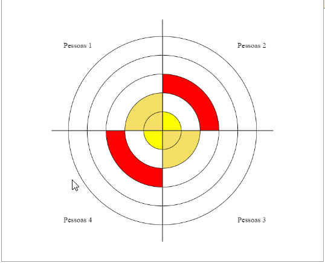

# ekg_polar
JS Polar area chart


# O Que é? 

O EKG Polar é uma lib para tornar dinâmica e responsiva a criação do grafo polar. Exemplo: 




Esta lib partiu da aplicação criada para gerar imagens para roda Agil, assement criado por Ana G Soares para medir times Ágeis. 


# Como usar 

Para usar você deve importar a lib e configurar os dados para que o gráfico seja construido a partir dos mesmos. Do seguinte modo: 

```js
		let data = [
			{label: 'Pessoas 1', value:3, colors: ['yellow','#fff','red']},
			{label: 'Pessoas 2', value:2},
			{label: 'Pessoas 3', value:3, colors: ['yellow','#fff','red']},
			{label: 'Pessoas 4', value:2},
		]

		let options = {
			layers: 5,
		}

		let canvasShow = document.querySelector("#canvas-show"); 

		const { initConfig } = EkGraph;
		initConfig(canvasShow, data, options);
```

Desta forma o gráfico será contruido no canvas passado para as configurações. 
