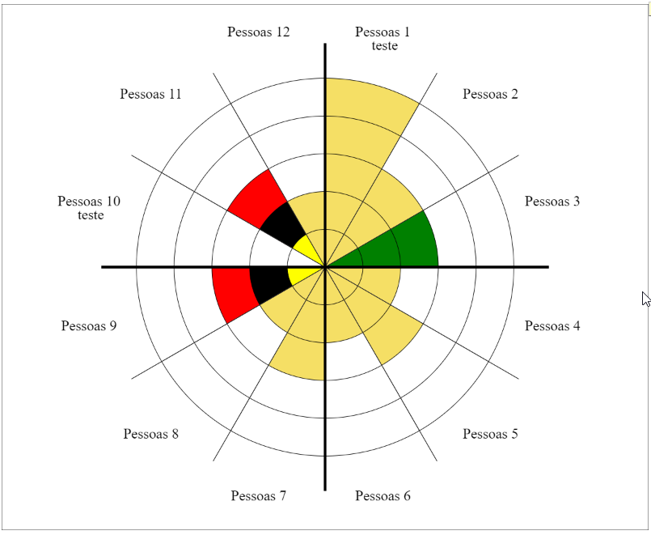

# _polar
JS Polar area chart


# EkGraph O Que é? 

O EKG Polar é uma lib para tornar dinâmica e responsiva a criação do grafo polar. Exemplo: 




Esta lib partiu da aplicação criada para gerar imagens para roda Agil, assement criado por Ana G Soares para medir times Ágeis. 


# Como usar 

Para usar você deve importar a lib e configurar os dados para que o gráfico seja construido a partir dos mesmos. Do seguinte modo: 

```js
		let data = [
			{label: 'Pessoas 1', value:3, colors: ['yellow','#fff','red']},
			{label: 'Pessoas 2', value:2},
			{label: 'Pessoas 3', value:3, colors: ['yellow','#fff','red']},
			{label: 'Pessoas 4', value:2},
		]

		let options = {
			layers: 5,
		}

		let canvasShow = document.querySelector("#canvas-show"); 

		const { initConfig } = EkGraph;
		initConfig(canvasShow, data, options);
```

Desta forma o gráfico será contruido no canvas passado para as configurações. 


# Recursos 

* __fillGraphData__: Função que deve receber um array com os dados para a construção do Gráfico. Este array deve conter os objetos que representam um segmento (fatia) com os dados: 
	- Label: texto que será utilizado naqula fatia
	- value: até qual bloco será pintado aquele segmento
	- colors [opcional]: caso queira modificar as cores para um unico pedaço. note que, caso a fatia tenha 5 divisões e você insira um array com duas cores, a última será utilizada até o fim do preenchimento. 
* __initConfig__: Este é o método que deve receber as configurações inicias do gráfico. Este método recebe:
	- canvas, data, options){
	- data: o array de dados que deve ser usado no método __fillGraphData__ que será chamado na inicialização
	- options: objeto com o numero de layers (blocos por fatia).
* __drawSlice__: este método deve ser usado para preencher um segmento do gráfico, passando qual o segmento e qual o nivel dele (Exemplo: drawSlice(3,3); isto deve pintar o slice 3 até o nivel 3 - como a imagem acima).
* __setColors__: serve para modificar o array de cores padrão para preenchimento do segment.
